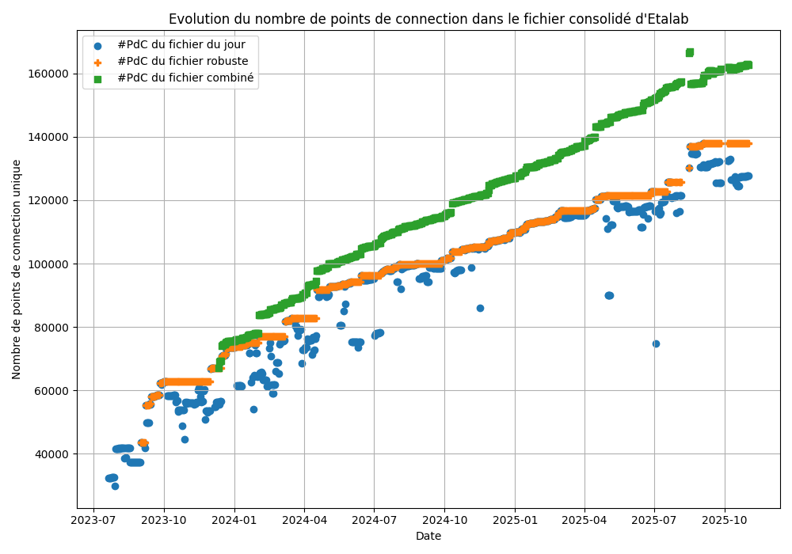

# Nettoyage des données IRVE de data.gouv.fr
Ce repository vise à avoir des données de borne de recharge électrique à jour et nettoyées, basée sur les données de data.gouv.fr.

Le nettoyage effectué est très simple et s'appuie sur deux règles :
    1 - Le id_pdc_itinerance est unique
    2 - La puissance_nominale d'une borne publique ne peut être supérieure à 2MW

## Unicité du id_pdc_itinerance
Les id_pdc_itinerance sont supposés être uniques. Cependant, lors de mise à jour de données ou lors de doubles déclarations, il peut arriver que la consolidation récupère deux fois un même point de connection. Dans ce cas, les valeurs sont filtrées et seule la dernière modification est prise en compte.

## Limitation de la puissance_nominale
Plusieurs aménageurs déposent des données avec des puissance exprimées en Watts, au lieu des kiloWatts dans le schéma de donnée. Si la borne de recharge est notée avec une puissance_nominale supérieure à 2000kW, alors on choisit la puissance_nominale / 1000 à la place.

N.B.:  Mal renseignées, les bornes de 1.5kW à distination des vélos électriques principalement, peuvent donc être confondue avec des bornes de 1.5MW, qui sont plutôt des bornes de recharge rapide pour camion (peu répandues en 2023).

## Evolution du nombre de point de connection en base
Le nombre de point de connection en base dépend à la fois du nombre de point de connection effectivement installé et des déclarations effectuées sur le site de data.gouv.fr.

## Note finale
Ce méthodologie de nettoyage de données très simple n'enlève certainement pas toutes les incohérences de données. Il est laissé à la charge des aménageurs ou des opérateurs des bornes de fournir des données de bonne qualité pour faciliter l'accès à leurs installations.